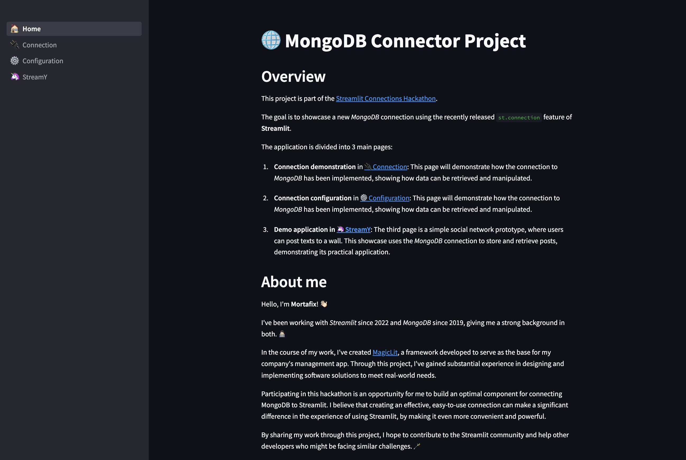

[](https://mongo-connector.streamlit.app)
[](https://pypi.org/project/st-mongo-connection/)
[](https://github.com/psf/black)

# Streamlit MongoDB Connector

This repository contains the source code for a MongoDB connector developed for the [Streamlit Connections Hackathon](https://discuss.streamlit.io/t/connections-hackathon).  
The goal of this project is to showcase how to leverage the power of Streamlit's new `st.connection` feature to connect Streamlit applications with MongoDB databases, and use this connection in practical applications.

[](https://mongo-connector.streamlit.app/)

## Installation & Usage

The package can be installed via [PyPi](https://pypi.org/project/st-mongo-connection/).
```bash
pip3 install st_mongo_connection
```
and the following is a simple example to use it
```python
import streamlit as st
from st_mongo_connection import MongoDBConnection

connection = st.connection("mongodb", type=MongoDBConnection)
st.help(connection)
```
If you want a real example and a detailed implemetation check out the [streamlit app](https://mongo-connector.streamlit.app).

## Overview

The application is divided into three main sections:

1. **Connection Demonstration**: Shows how the connection to MongoDB has been implemented, demonstrating how data can be retrieved and manipulated.

2. **MongoDB Configuration**: Demonstrates how to configure the MongoDB connection, explaining how to set it up via the `secrets.toml` file or directly through the `st.connection` call.

3. **StreamY**: A prototype for a simple text-based social network, where users can post texts on a wall. This showcases the MongoDB connection's use in a practical application, as it's used to store and retrieve posts.


## About me
Hello! I'm Moris, a Computer Science Master's graduate with extensive experience in Streamlit and MongoDB. I've developed the [MagicLit](https://magiclit.streamlit.app) framework to serve as the base for my company's management app.  
I participated in this hackathon to create an optimal component for connecting MongoDB to Streamlit. I hope this project will contribute to the Streamlit community and assist other developers.