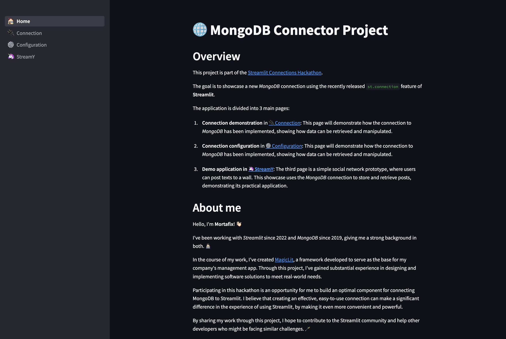

# Streamlit MongoDB Connector

This repository contains the source code for a MongoDB connector developed for the [Streamlit Connections Hackathon](https://discuss.streamlit.io/t/connections-hackathon).  
The goal of this project is to showcase how to leverage the power of Streamlit's new `st.connection` feature to connect Streamlit applications with MongoDB databases, and use this connection in practical applications.

## Overview

The application is divided into three main sections:

1. **Connection Demonstration**: Shows how the connection to MongoDB has been implemented, demonstrating how data can be retrieved and manipulated.

2. **MongoDB Configuration**: Demonstrates how to configure the MongoDB connection, explaining how to set it up via the `secrets.toml` file or directly through the `st.connection` call.

3. **StreamY**: A prototype for a simple text-based social network, where users can post texts on a wall. This showcases the MongoDB connection's use in a practical application, as it's used to store and retrieve posts.

## About me
Hello! I'm Moris, a Computer Science Master's graduate with extensive experience in Streamlit and MongoDB. I've developed the [MagicLit](https://magiclit.streamlit.app) framework to serve as the base for my company's management app.  
I participated in this hackathon to create an optimal component for connecting MongoDB to Streamlit. I hope this project will contribute to the Streamlit community and assist other developers.